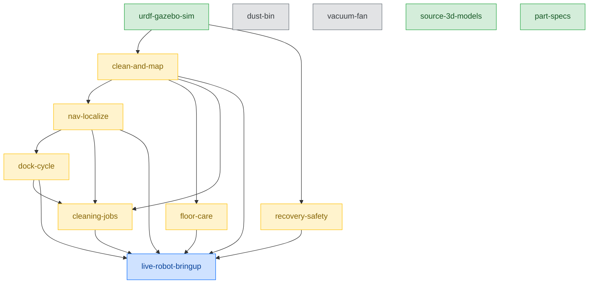

# oomwoo

**The open-source robot vacuum you build yourself.**

Raspberry Pi · ROS2 · Home Assistant · 2D LiDAR · 3D printed · ESP32 · Arduino

## What is this?

oomwoo is an **open-source home robot vacuum** you can build yourself, made for the
Raspberry Pi, ROS2, Home Assistant, and 3D-printing communities. It uses an
affordable 2D LiDAR to map your home and navigate on its own. Local, no
cloud required for regular functionality, no vendor lock-in. Follow the [community newsletter](https://stats.sender.net/forms/bo2rAK/view).

Reference design images - this is approximately how the finished design will look:

## Goals

- Affordable, fully open hardware, software and firmware
- Home appliance product quality - not a throwaway build
- Easy to build, with step-by-step zero-to-hero instructions
- 2D LiDAR mapping and autonomous navigation (ROS2 / Nav2)
- Native Home Assistant integration for local control
- 3D-printable, documented, and hackable chassis
- Buildable from parts you source yourself
- Local, no cloud required for regular functionality
- Optional extra functionality when connected cloud
- Apps on top of ROS2 to customize vacuum operation
- Stretch goal: App store
- Stretch goal: LeRobot integration, OpenClaw

** v0 target: bare-bones build:

- 3D-printed chassis
- ROS2 Gazebo sim
- LiDAR with manual SLAM
- ROS2 on Raspberry Pi 5 AND/OR ESP32 running micro-ROS with ROS2 on local PC - decision TBD

Open Source Deliverables:

- [ ] [Bill of materials (BoM)](BOM.md)
- [ ] 3D-printable files
- [ ] ROS2 packages
- [ ] Firmware
- [ ] Motor drivers and sensors PCB
- [ ] [Build, setup, bringup and troubleshooting instructions](BUILD_INSTRUCTIONS.md)
- [ ] Demo video(s)

## Build one

> **Status: design / RFC stage.** Step-by-step build instructions don't exist yet —
> they arrive once the first BoM and parts are validated (**first BoM targeted ~mid-July**).

- 📋 **[Bill of Materials (BoM)](BOM.md)** — work-in-progress parts list + budget target
- 🛠️ **[Build Instructions](BUILD_INSTRUCTIONS.md)** — placeholder for now; how to follow along

Full build docs and a complete BoM are on the way, with the goal that you can
source every part yourself.

## Contributing

Would you like to contribute? See [CONTRIBUTING](docs/CONTRIBUTING.md) for the full guide.

oomwoo is organized to built by the community, massively **in parallel**.
The vacuum and its software are subdivided into [modules](#requests-for-contributions), see list below.

A volunteer picks whatever module she wants, works on that module whenever she wants,
submits her contribution as a PR under contributions/module-name/<her-github-username>.

Multiple developers are welcome to work on the same module.
The best solution for each module surfaces for over time, with the project master having the last call.

1. Pick a contribution from the [list below](#requests-for-contributions).
2. [Let us know](https://github.com/makerspet/oomwoo/discussions) you're working on it and your progress.
3. Check [ARCHITECTURE.md](docs/ARCHITECTURE.md) for the system design and interfaces.
4. Say hi on [Discord](https://discord.gg/3y2JKz5T25)

Follow us building in public:

- Reddit: build-in-public home at [r/ArduinoAndRobotics](https://www.reddit.com/r/ArduinoAndRobotics/)
- YouTube: [build-in-public channel](https://www.youtube.com/@makerspet)
- X: [@0OMWO0](https://x.com/@0OMWO0)
- [Community newsletter](https://stats.sender.net/forms/bo2rAK/view).

## How the RFCs fit together

The modules can be worked on **in parallel**, but some build on others. An arrow
**A → B means "B builds on A"** — green modules are ready now; amber modules are
unblocked once their parents land; the blue one needs real hardware; grey modules are
**on hold**. `source-3d-models` and `part-specs` are ready now; the mechanical **design**
modules (`dust-bin`, `vacuum-fan`) are on hold pending sourced parts + a 3D
reference-design sketch.

> A standalone image of this graph (with a legend) lives at
> [`assets/rfc-graph.png`](./assets/rfc-graph.png) for sharing on Discord, Reddit, etc.
> The source is [`assets/rfc-graph.mmd`](./assets/rfc-graph.mmd) — edit it and re-export
> with `npx @mermaid-js/mermaid-cli -i assets/rfc-graph.mmd -o assets/rfc-graph.png -s 3`.

## Requests for Contributions

| Module | ID | Phase | Notes |
|---|---|---|---|---|
| ROS2 URDF + Gazebo sim | [urdf-gazebo-sim](./contributions/urdf-gazebo-sim) | Submitted — [PR #10](https://github.com/makerspet/oomwoo/pull/10) by @alvarosamudio | URDF, diff-drive, LiDAR, bumper, 5 worlds, SLAM/Nav2 config |
| First clean: coverage + mapping + exploration | [clean-and-map](./contributions/clean-and-map) | Blocked by urdf-gazebo-sim | Coverage cleaning while SLAM-mapping and exploring, in Gazebo |
| Localization & navigation on a known map | [nav-localize](./contributions/nav-localize) | Blocked by urdf-gazebo-sim, clean-and-map | Nav2 nav, AMCL localization, relocalize when lost, resume map |
| Dock cycle: undock, dock, recharge | [dock-cycle](./contributions/dock-cycle) | Blocked by urdf-gazebo-sim, nav-localize | Undock, return-to-dock, precise docking, station services, find dock when lost |
| Recovery behaviors & safety | [recovery-safety](./contributions/recovery-safety) | Blocked by urdf-gazebo-sim | Recovery ladder, escalation, pause-and-alert, safety sensors, status reporting |
| Floor-surface handling & edge cleaning | [floor-care](./contributions/floor-care) | Blocked by urdf-gazebo-sim, clean-and-map | Wall/edge following, carpet vs hardwood, mop lift/lower |
| Cleaning modes, zones & job orchestration | [cleaning-jobs](./contributions/cleaning-jobs) | Blocked by urdf-gazebo-sim + behaviors | Modes (regular/spot), virtual walls, room segmentation, job splitting + resume |
| Live robot bring-up & validation | [live-robot-bringup](./contributions/live-robot-bringup) | Blocked by behaviors + needs hardware | Connect real vacuum to ROS2, re-run sim tests on hardware |
| Dust bin 3D design | [dust-bin](./contributions/dust-bin) | ⛔ On hold | Design/print/test dust bin — waits on sourced parts + 3D design |
| Vacuum fan / blower assembly | [vacuum-fan](./contributions/vacuum-fan) | ⛔ On hold | Fans already sourced (see BOM); volute/gasket design waits on the 3D design |
| Source 3D models (STEP) for BOM parts | [source-3d-models](./contributions/source-3d-models) | Ready to start work | Obtain / measure / model STEP files of off-the-shelf parts (wheels, fans, caster…) so mounts fit |
| Procure part specs & datasheets | [part-specs](./contributions/part-specs) | Ready to start work | Find/measure/reverse-engineer specs (pinouts, encoder PPR, torque, how to drive fans…) for sourced parts |

> The full granular module list lives in [docs/RFC_MASTER_LIST.md](docs/RFC_MASTER_LIST.md).

## Source code reference

- [oomwoo ROS2 and Ubuntu installation](https://github.com/makerspet/oomwoo-install/) source code
- [oomwoo ROS2 URDF package and config](https://github.com/makerspet/oomwoo_urdf/) source code
- [remakeai reference vacuum teardown](https://github.com/remakeai/vacuum-cleaner-teardown) — a consumer LiDAR vacuum with a basic dock and stationary mop.

## Related prior art

- [AlieksieievYurii/vacuum-cleaner](https://github.com/AlieksieievYurii/vacuum-cleaner) — a DIY 3D-printed robot vacuum (Raspberry
  Pi Zero W, gyroscope-based, Fusion 360, Android control app, no dock)
- [kaiaai/LDS](https://github.com/kaiaai/LDS), [kaiaai/lds2d](https://github.com/kaiaai/lds2d) — open-source 2D LiDAR libraries (C++, Python) supporting 23+ LiDAR models
- [remakeai/vacuum_ros2_bridge](https://github.com/remakeai/vacuum_ros2_bridge) — ROS2 bridge for a 3irobotix CRL-200-based vacuum (Proscenic), full ROS2 control
- [Valetudo](https://github.com/Hypfer/Valetudo) — cloud-free firmware replacement for commercial vacuums (local app-level control, not ROS2)
- [Dennis Giese / robotinfo.dev](https://robotinfo.dev) — teardowns and rootability of commercial robot vacuums.
- [codetiger/VacuumTiger](https://github.com/codetiger/VacuumTiger) - 3irobotix CRL-200-based vacuum low-level control reverse engineered
- [Build a ROS2/LiDAR robot crash course](https://makerspet.com/blog/build-arduino-self-driving-robot-video-instructions/) - watch this if you have no robotics experience
- [Open Mower](openmower.de) - open-source outdoor lawn mower

## Design research

We reviewed the 2025–2026 consumer robot vacuum landscape (global + China-sourceable
brands, all price tiers) to decide which solutions to copy and which to skip. Key
takeaways for the build:

- **Suction is a sourcing problem, not an engineering one.** Real-world cleaning does
  **not** track advertised suction (Pa); ~$500 mid-tier models beat flagships. A
  moderate **sealed** sourced motor + a good brush + tight airflow sealing matches
  flagships — **no custom impeller needed.**
- **"Never gets stuck" needs camera + AI sensor fusion**, not LiDAR alone — LiDAR is
  blind below its ~10 cm turret (cables, socks). v1 leans on the **bumper** for low
  obstacles; vision-based avoidance is a later / experimental goal, not an MVP promise.
- **Anti-tangle brush:** a **tapered rubber roller** resists hair-wrap best (a top user
  complaint) and is easy to 3D-print.
- **Mop:** a 3D-printed **dual-spinning** mop is competitive; the self-washing roller
  mop's edge is overstated and hard to replicate — skip it for now.

**Well-loved models worth studying:** Eufy Omni S2 (obstacle avoidance), Narwal Flow
(roller mop), Ecovacs Deebot T90 Pro Omni (~$499 all-rounder), Dreame X40 Ultra
(dual-spinning mop). **Dreame** is also the most [Valetudo](https://github.com/Hypfer/Valetudo)-rootable
brand — the safest donor to study. *(Per-model rankings are directional, from
single-run reviewer tests.)*

## About

The project name "oomwoo" is a rotational ambigram - it reads the same flipped 180°, like the robot itself, roaming your floor in every direction.

The project is sponsored by makerspet.com and remake.ai. We are reusing their open-source solutions.
- If you'd rather skip the parts hunt, a kit (motors, PCB, brushes, gaskets, LiDAR) will be available at [makerspet.com](https://makerspet.com), from the same maker behind this project. The kit is a convenience, never a requirement. **Everything here stays open.**
- When we get to apps, [remake.ai](https://remake.ai) will be providing its robot apps platform and app store. Using the app store will be entirely optional. The vacuum will **always support cloud-free, local operation for regular functionality out-of-the-box**. 

## License

Code is released under the [Apache License 2.0](LICENSE).

Hardware design files, once added, to be released under an open hardware
license (TBD).

## Star History

